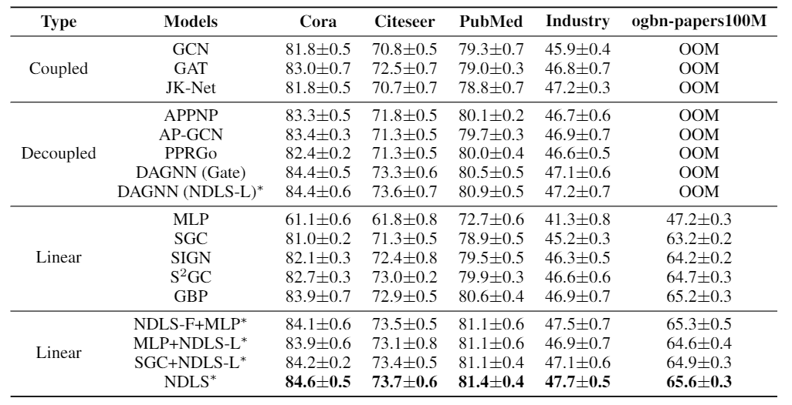
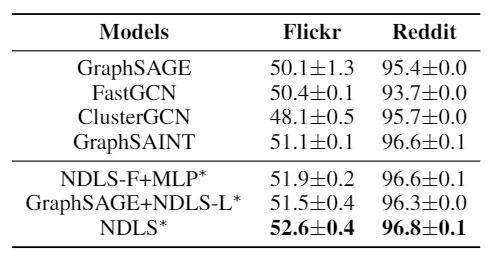
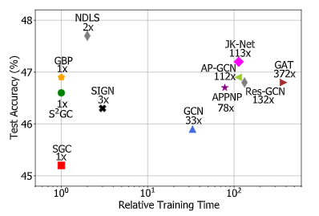

## Node Dependent Local Smoothing for Scalable Graph Learning


### Requirements

Environments: Xeon Gold 5120 (CPU), 384GB(RAM), TITAN RTX (GPU), Ubuntu 16.04 (OS)

The PyTorch version we use is torch 1.7.1+cu110. Please refer to the official website -- https://pytorch.org/get-started/locally/ -- for the detailed installation instructions.

To install other requirements:

```setup
pip install -r requirements.txt
```


### Training

To train the model(s) in the paper, run this command:

```train
cd src; python train.py --dataset cora/citeseer/pubmed
```

Please refer to the Appendix for the detailed hyperparameters.


### Node Classification Results

1. Transductive Setting:

   

2. Inductive Setting: 

   

3. Efficiency Comparison: 

   

## Cite

If you use NDLS in a scientific publication, we would appreciate citations to the following paper:
```
 @article{zhang2021node,
  title={Node Dependent Local Smoothing for Scalable Graph Learning},
  author={Zhang, Wentao and Yang, Mingyu and Sheng, Zeang and Li, Yang and Ouyang, Wen and Tao, Yangyu and Yang, Zhi and Cui, Bin},
  journal={Advances in Neural Information Processing Systems},
  volume={34},
  year={2021}
}
```
   
